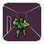

# Xeen Map Editor
This addon for the Godot Engine adds a grid based 3D map editor.

If you want to use it, you can configure stuff in `addons/xeen/config`.

Enjoy!

# Issues
- [ ] (Priority 4, Easy) Fix docgen.py to properly parse and write method parameters.
- [ ] (Priority 4, Easyish) rewrite shortcut code so it overrides editor keybinds
- [ ] (Priority 6, ?) Updated previews aren't shown in the asset browser
- [ ] (Priority 7, Easy) Make box fill/clear algorithm more efficient
- [ ] (Priority 9, ?) The cell picker code should also work in orthographic projection

# Milestones
## 0.1
- [ ] Basic editing features 
- [ ] simple map settings
- [ ] simple box select
- [ ] simple toolbar
- [ ] material browser & brush view (incl. basic face settings)
- [ ] no memory leaks
- [ ] tutorial

# Features
## Essential
### Basic Editing
- [x] Show a grid and the cell the mouse is hovering over in the 3D vieweport
- [x] I can see the map coordinate of the mouse in the editor.
- [x] I can put a cell instance on the grid by left clicking on it.
- [x] I can ctrl click on an existing cell instance to remove it.
- [x] I can undo and redo edits.
- [x] Walls between adjacent cell instances are automatically hidden.
- [x] The map can be saved and reloaded
- [x] The map works both at runtime and in the editor. It allows the implementation of grid-based player movement.
- [x] I can select materials for each face in the GUI ("cell brush"). New cells will have those materials applied.
    - [x] Keyboard shortcuts implemented
    - [x] I can undo and redo changing materials
- [x] I can select materials and scenes from an asset browser
    - [x] I can filter the material list via a line input.
- [x] When I click on an existing cell, its materials will be set to the brush's materials.
- [x] I can paint multiple cells by clicking and dragging
- [ ] Holding a modifier key while left clicking paints the surrounding walls with the current brush.

### Simple Box Select
- [x] I can enable a selection mode that allows me to click and drag to select an area of the map.
- [x] I can click outside of the selection to clear it and there is also a keyboard shortcut.
- [x] While in selection mode, I can hit enter to fill the selection with the current brush.
- [ ] While in selection mode, I can hit 'x' or delete to remove all cells in the selection
- [ ] I can cut, copy and paste the selected cells.
- [ ] I can drag the selection to move the cells.
    - Separate move tool?
- [ ] I can rotate or flip the selection (as a whole)

### Simple Map Settings
- [ ] I can resize and crop the map without losing all data.
- [ ] I can press a button to clear the map
- [ ] I can change the map resource in the GUI.
- [ ] I can create a new map resource in the GUI.

### Advanced Editing
- [ ] I can add a cell object to a cell instance that can be accessed through the map class (doors, chests)
- [ ] I can rotate and flip cell objects

#### Cells and Faces
- [ ] I can flip and rotate UV coordinates for each face in the brush view.
- [ ] I can override which faces to show in the cell brush ("always visible", "always show", "auto")
- [ ] I can mark cell faces as passable for open doors and such
- [ ] I can set the cell brush materials by picking an existing cell instance (LMB+Shift perhaps?).
    - [ ] There is a tool button to switch to 'material picker mode'
    - [ ] When I click on the button my cursor changes to indicate the tool mode
    - [ ] Clicking on a cell sets my brush to the materials in that cell
    - [ ] Holding a modifier key allows me to select the material of a single face

### Runtime
- [x] I can determine if an actor can move from a cell to another (by direction)
- [x] I can change cell face materials and visibility at runtime. 
- [ ] I can generate a simple move graph for astar.
- [ ] I can generate a dijkstra map with custom goals.

## Nice to Have
### Editing
- [ ] I can vertically translate all 8 vertices of a cell to create sloped floors and ceilings and to adjust the height
- [ ] Cells, faces and cell brushes can be extended to allow custom functionality, but have a common interface
- [ ] I can create full 3D maps (multiple layers)
- [ ] I can toggle a setting to render back-faces semi-transparently.

### Runtime
- [ ] Maps can be 'chunked' so that chunks are saved to separate resources and can be separetely loaded and unloaded at runtime.

## Wishful thinking
- [ ] Maps can interact with each other so the player can move between them seamlessly
- [ ] I can mark cells as 'static', which optimises the geometry at runtime.
- [ ] Cells create additional geometry to fill gaps between neighbours (like in Delver's editor)

# Brainstorm etc.
## Common Use-Cases and How to Enable Them

### Doors
- Doors consist of a door frame and the door itself. Ideally, the door can be animated.
- The most straightforward implementation right now is via Cell Objects.
    - Cell Objects need to be implemented and either referenced in the cell or the map.
    - Common player actions like 'bump' or 'activate' need to be delegated to the cell object.
    - When determining whether a given cell can be entered, cell objects need to be considered.
- Another way to implement doors is to allow subclassing of cells/faces. This is arguably more work.

### Mobs
- The map or cells should know the location of a mob.
- The map needs to provide data for astar and/or a dijkstra map
- When determining cell passability, mobs need to be considered.
